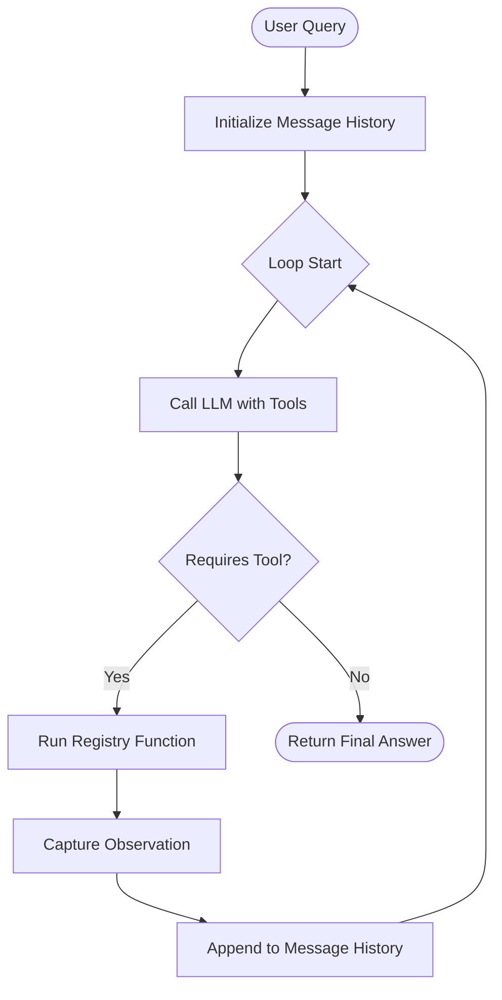

# Lesson 5.0: The Agentic Loop from First Principles

In this lesson, we dissect the core logic of all agentic systems: the **Perceive-Plan-Act-Observe** loop.

---

## 1. The Anatomy of an Agent Loop

At its core, an AI agent is not just a single static query to an LLM. It is a **loop of model calls and tool executions** that continues until the problem is solved.



The loop consists of four sequential steps:
1. **Perceive:** The system receives inputs (either the initial user question or the result of a tool execution).
2. **Plan (Thought):** The LLM reasons about the current state of the query and determines what to do next.
3. **Act (Action):** The LLM requests the execution of a specific tool with defined input parameters.
4. **Observe (Observation):** The application executes the requested tool in the local system or network, captures the output, and feeds it back to the LLM.

---

## 2. Text Parsing (ReAct) vs. Native Function Calling

### A. Text Parsing (ReAct Pattern)
In the original 2022 ReAct paper (*Reason and Act*), models were instructed to write thoughts and actions in a specific text format:
```text
Thought: I need to find out what time it is.
Action: get_current_time
Action Input: none
```
The developer writes regular expressions (Regex) to extract the tool name and input from the text. 
* **The Problem:** It is incredibly fragile. If the model outputs `Action: get_current_time()` or forgets the `Action Input:` label, the regex parser fails, breaking the loop.

### B. Native Function Calling
Modern models support native tool calling. Developers define tools using standard **JSON Schemas** describing the function arguments. The model then outputs structured JSON metadata directly.
* **Why it is superior:** It eliminates regex parsing errors. The API provider guarantees that the model output is structured, making agent execution highly reliable.

---

## 3. Why Agents Fail

1. **Infinite Loops (Thundering Herd):** If a tool returns an error, the agent might repeatedly call the same tool with the same input, getting stuck in an infinite loop.
2. **Hallucinated Tools:** The agent tries to invoke a tool that doesn't exist (e.g. `get_stock_price`), expecting the application to know how to execute it.
3. **Max Iteration Exhaustion:** To protect against infinite loops and ballooning API costs, agents must implement a **max iterations guard** (typically 5 to 10 cycles). If the limit is reached without a solution, the loop exits safely.
